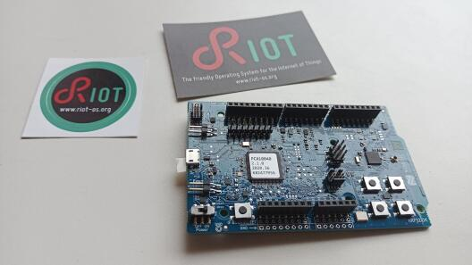

# Getting Started

Welcome to RIOT, the friendly Operating System for the Internet of Things!

RIOT is a free, open source, real-time capable operating system developed by a grassroots community
gathering companies, academia, and hobbyists, distributed all around the world.
It supports most low-power IoT devices, microcontroller architectures (32-bit, 16-bit, 8-bit), and external devices.
RIOT aims to implement all relevant open standards supporting an Internet of Things that is connected, secure, durable & privacy-friendly.

Pretty cool, right?

## Prepare your development setup

The best - or at least easiest way - to work on RIOT is to use Linux as your host OS. You can either run it natively on your machine
or in a virtual machine like [VirtualBox](https://www.virtualbox.org/wiki/Downloads).
You can find the [general instructions to set up your RIOT development environment](https://doc.riot-os.org/getting-started.html)

## RIOT on the nrf52840 Development Kit


### Programmers
When working with RIOT on the [nrf52840dk](https://www.nordicsemi.com/Products/Development-hardware/nrf52840-dk) a couple of things are useful to know.
Since the board has its own SEGGER J-Link debugger/programmer on board no additional hardware is required for flashing the board with your RIOT application or debugging one. (In fact, you can even use this board's SEGGER device to flash other devices.) From the software side you can flash the board with SEGGER's [J-Link tool](https://www.segger.com/downloads/jlink/) or [OpenOCD](https://openocd.org).

### Reset Pin Configuration
As documented in the [RIOT documentation](https://doc.riot-os.org/group__boards__nrf52840dk.html) the *reset* pin of the board is per default no configured to perform a reset. However, the behavior of this pin can be configured via software. The RIOT repository provides the [nrf52_resetpin_cfg](https://github.com/RIOT-OS/RIOT/tree/master/dist/tools/nrf52_resetpin_cfg) application in order to do so. However, in some cases (on some revisions of the chip?) this will leave the MCU in a *locked* state. In this case, you can use the tool [nrfjprog](https://www.nordicsemi.com/Products/Development-tools/nrf-command-line-tools) in order to configure the pin via the command:
```
nrfjprog --pinresetenable
```

### Recovering a Locked nrf52840 Chip
In case your *nrf52840* is in a locked state and you're trying to program the device with *OpenOCD* you will get an error message like this:
```
Error: Could not find MEM-AP to control the core
****** WARNING ******
nRF52 device has AP lock engaged (see UICR APPROTECT register).
Debug access is denied.
Use 'nrf52_recover' to erase and unlock the device.
```
One possibility to do so is by calling
```
openocd -c 'interface jlink; transport select swd; source \
[find target/nrf52.cfg]' -c 'init'  -c 'nrf52_recover'
```
Please note that this call will not automatically return. The output should look similar to this
```
Waiting for chip erase...
nrf52.cpu device has been successfully erased and unlocked.
Info : nrf52.cpu: hardware has 6 breakpoints, 4 watchpoints
Info : Listening on port 6666 for tcl connections
Info : Listening on port 4444 for telnet connections
Error: nrf52.cpu -- clearing lockup after double fault
Polling target nrf52.cpu failed, trying to reexamine
Info : nrf52.cpu: hardware has 6 breakpoints, 4 watchpoints
```
Just exit via Ctrl+C and the device should be programmable via OpenOCD again. Another option is to use `nrfjprog --recover`. (However, note that both procedures will reset the entire flash of the device -- including the reset pin configuration.)
