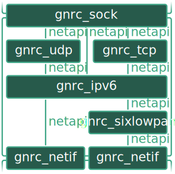

# GNRC and NETAPI

RIOT provides a modular network stack, GNRC, which allows an isolated implementation of protocols on
any layer of the OSI model. The protocol implementations communicate via an API called *NETAPI*.



*NETAPI* consists of 5 IPC API operations, 2 packet operations and 3 option operations. It utilizes
the [msg API](https://doc.riot-os.org/group__core__msg.html) of the RIOT core:

- `GNRC_NETAPI_MSG_TYPE_RCV`: Asynchronously pass packets up the network stack
  (receive from upper protocol).
- `GNRC_NETAPI_MSG_TYPE_SND`: Asynchronously pass packets down the network stack
  (send from lower protocol).
- `GNRC_NETAPI_MSG_TYPE_SET`: Synchronously set an option for a protocol.
- `GNRC_NETAPI_MSG_TYPE_GET`: Synchronously get an option for a protocol.
- `GNRC_NETAPI_MSG_TYPE_ACK`: Reply `SET` and `GET`. Returns success and error codes as well
  as the actual value for `GET`.


Other protocols can register to packet operations using the
[network protocol registry `gnrc_netreg`](https://doc.riot-os.org/group__net__gnrc__netreg.html).

To use GNRC we need to include at least one GNRC submodule, IPv6 in our case:

```Makefile
USEMODULE += gnrc_ipv6_default
```

The core GNRC API, including NETAPI, `gnrc_netreg`, and also the interface API `gnrc_netif` is
exposed via the `net/gnrc.h` header file:

```C
#include "net/gnrc.h"
```

## Getting the IPv6 addresses of a network interface

Flash the application to your node and open a terminal.

```sh
make flash term
```

It will show the IPv6 address for the network interface—you might need to reset your node.
Alternatively, you can use the `ifconfig` command in the RIOT shell.

```
ifconfig
```

`main.c` shows how to `GET` the IPv6 addresses of all interfaces of a node.

`gnrc_netif_iter()` is used to iterate over all interfaces:

```C
gnrc_netif_t *netif = NULL;
while ((netif = gnrc_netif_iter(netif))) {
    /* operations on `netif` */
}
```

The `gnrc_netapi_get()` helper function is used to call the `GNRC_NETAPI_MSG_TYPE_GET` IPC operation
for getting the IPv6 addresses of `netif`, identified by its PID.

```C
ipv6_addr_t ipv6_addrs[CONFIG_GNRC_NETIF_IPV6_ADDRS_NUMOF];
int res = gnrc_netapi_get(netif->pid, NETOPT_IPV6_ADDR, 0, ipv6_addrs,
                          sizeof(ipv6_addrs));

if (res < 0) {
    puts(" {}");
    continue;
}
for (unsigned i = 0; i < (unsigned)(res / sizeof(ipv6_addr_t)); i++) {
    /* output the address */
}
```

Note, that in an error case we just skip the interface all together and that the return value of
`gnrc_netapi_get()` contains the result in bytes, not in number of addresses, due to the generic
nature of `GET`.

## Task 1

Register the application to receive IPv6 messages and handle them.

To be able to receive packets asynchronously in the first place, the thread needs a message
queue:

```C
msg_t msg_queue[MSG_QUEUE_SIZE];
msg_init_queue(msg_queue, MSG_QUEUE_SIZE);
```

`MSG_QUEUE_SIZE` is already defined in `main.c` and must be a power of 2.

You can register for packets of a certain type (protocol) and context (the experimental protocol
number 253 in our case) using `gnrc_netreg_register()` from `net/gnrc/netreg.h` (which is provided
via `net/gnrc.h`):

```C
gnrc_netreg_entry_t server = GNRC_NETREG_ENTRY_INIT_PID(253, thread_getpid());
gnrc_netreg_register(GNRC_NETTYPE_IPV6, &server);
```

You can receive packets using the `msg_receive()` function from `msg.h`. The type of the message
(`msg.type`) contains the NETAPI operation type, `msg.content.ptr` a pointer to the packet.

In GNRC, packets are represented as parsed list and are in reverse order on
receive: The payload will be the first with the next lower layer header
following that and the lowest layer header being last.

Remember to release packets after you used them using `gnrc_pktbuf_release()`.
Otherwise, you will create memory leaks.

```C
while (1) {
    msg_t msg;
    gnrc_pktsnip_t *pkt;

    msg_receive(&msg);
    if (msg.type == GNRC_NETAPI_MSG_TYPE_RCV) {
        gnrc_pktsnip_t *pkt = msg.content.ptr;

        if (pkt->next) {
            /* print IPv6 header */
            od_hex_dump(pkt->next->data, pkt->next->size, OD_WIDTH_DEFAULT);
        }

        /* print IPv6 payload */
        od_hex_dump(pkt->data, pkt->size, OD_WIDTH_DEFAULT);

        gnrc_pktbuf_release(pkt);
    }
}
```

Though the code will not be reachable, you can unregister from a registration using
`gnrc_netreg_unregister()` after the loop:

```C
gnrc_netreg_unregister(GNRC_NETTYPE_IPV6, &server);
```

Now you can receive IPv6 packets for the experimental transport protocol 253, but to test this?
Let us exchange data with other groups by sending packets!
